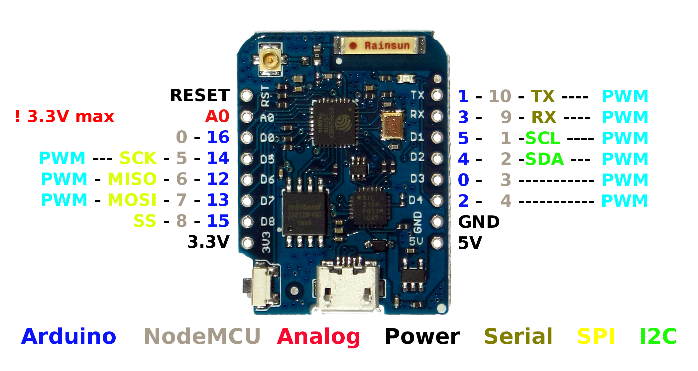

# RedThermostat

[RED]Thermostat is an ESP8266-based IOT that implements thermostat functionality

It can exist as a simple temperature sensor

or it can have a display, ability to set required temp, up/down buttons and can drive supplemental electric heat

RedGlobals.h has a number of #DEFINE switches that influence how this works:

- TEMP_SENSOR_PRESENT adds temperature reporting functionality
- DISPLAY_PRESENT shows current temperature on the display
- BUTTONS_PRESENT includes full thermostat functionality and the ability to set required temp

*** N.B.: A subset of the buttons can be implemented in hardware ***

*** N.B.2: Because of the minimal functionaly, this is considered the master template for all other [RED] devices***

# Version History

## V2.0
    switch to Homie.

## V1.1
    Initiale release on Arduino IDE

## V1.2
    Moved to Platform.IO

## V1.3
    Upgraded to support ArduinoJSON 6 
    WifiConfig & MQTTConfig now contain customizable sections

## V1.4

I2C-Display Branch 
Full implementation of I2C OLD display on a buttonless Wemos D1 mini 

## V1.5

It seems that the WEMOD generates enough heat to impact the sensor reading. One option is to
connnect D0/Wake pin to the RST pin and use deep sleep mode. The other is use sensor with a wire lead.

However, as an interim fix, we've implemented a linear adjustment function that tries to compensate
using measured reading of real temp vs reported temp.

# Hardware Notes

This program will probably run on a multitude of hardware. One variance is a naked temperature reporting board, the other is equipped with a display up/down keys and acts as a traditional thermostat. 

## Wemos D1 Mini
- Pin 0  is the program pin but also wakes the device and turn the screen on
- Pin 2 blueLED on ESP12e
- Pin 5 SCL drives the display
- Pin 4 SDA drives the display
- Pin 12 OneWire bus for temp sensors

## Wemos D1 Mini
- Pin 0  is the program pin but also wakes the device and turn the screen on
- Pin 2 blueLED on ESP12e
- Pin 5 SCL drives the display
- Pin 4 SDA drives the display
- Pin 12 OneWire bus for temp sensors

## Custom Board to replace Wall dumb thermostat 
- Pin 0  is the program pin but also wakes the device and turn the screen on
- Pin 2 blueLED on ESP12e
- Pin 1 SCL drives the display
- Pin 3 SDA drives the display
- Pin 5 UP button
- Pin 4 DOWN button
- Pin 12 OneWire bus for temp sensors
- Pin 13 Drives supplemental heat relay
